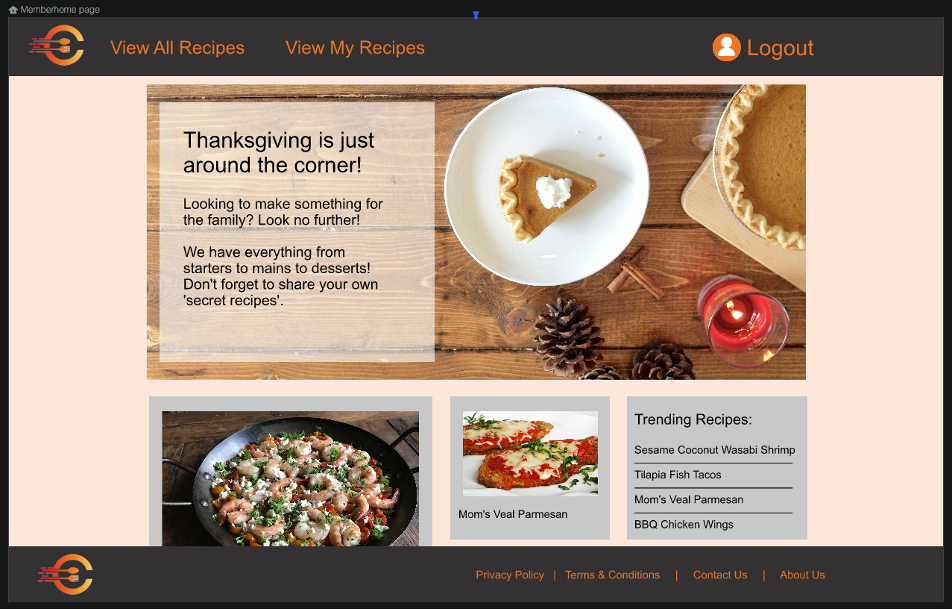

# ChefsWay

## Table of Contents
* [Project Description](#Project-Description)
* [User Story](#User-Story)
* [Acceptance Criteria](#Acceptance-Criteria)
* [Technologies Used](#Technologies-Used)
* [Screenshot](#Screenshot)
* [Submition Requirements](#Submition-Requirements)

## Project Description
In light of facilitating remote and COVID-19 safe activities, this project intends to allow users to create a profile whereby they are able to connect with fellow home cooks to create, edit, share and comment on recipes completely remotely.

## User Story
* AS a HOME COOK
    * I WANT to be able to join an online chef/baker community
    * SO THAT I can view, comment and share recipes with my fellow home cooks.

## Acceptance Criteria
* GIVEN my interest in sharing recipes
* WHEN I land on the home page
    * THEN I can sign-up to be a part of the community
* WHEN I sign up
    * THEN I then I can view all existing recipes or individual recipes
* WHEN I select a recipe
    * THEN the entire recipe will appear on the page
* WHEN I sign up for the newsletter
    * THEN I get confirmation that I am registered
* WHEN I go to add a comment to a recipe
    * THEN I can submit the comment & edit it if needed
* WHEN I logout
    * THEN I get confirmation that I have successfully logged out

## Technologies Used
* Dependencies include:
    * bcrypt: ^5.0.1
    * connect-session-sequelize: ^7.1.2
    * dotenv: ^10.0.0
    * express: ^4.17.1
    * express-handlebars: ^5.3.3
    * express-session: ^1.17.2
    * inquirer: ^8.1.5
    * mysql2: ^2.3.0
    * sequelize: ^6.6.5
* Libraries used:
    * UIkit - https://getuikit.com/
* Deployed via: Heroku

## Screenshot

## Submition Requirements
* URL of the deployed application: 
* URL of the GitHub repository: https://github.com/BootcampProject/ChefsWay.git)